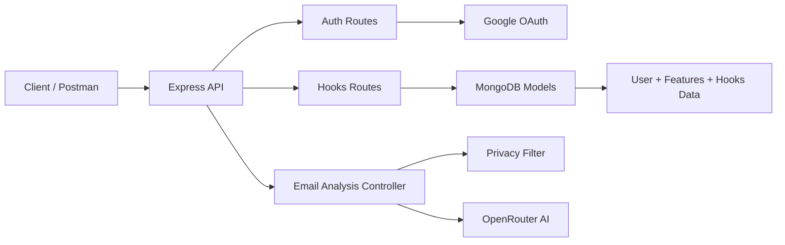

# Schedular Backend

<div align="center">
  
  
  
  
  
  
</div>

A smart backend service for scheduling, inbox automation, and AI-powered email analysis. It authenticates users with Google OAuth, stores hook-based rules, analyzes Gmail content safely, and prepares structured summaries for downstream AI processing.

---

## 🧭 Architecture Overview



---

## ✨ Features

- Google authentication flow for Gmail access
- JWT-based protected routes
- Hook management for user-defined automation rules
- Safe email filtering before sending content to AI
- AI-powered email analysis via OpenRouter
- MongoDB persistence through Mongoose

---

## 🧱 Project Structure

```text
Backend/
├── Controller/         # Route handlers and business logic
├── DB/                 # Database connection setup
├── Helpers/            # Utility helpers for auth, Gmail, and privacy filtering
├── Middlewares/        # JWT authentication middleware
├── Models/             # Mongoose schemas
├── Routes/             # Express route definitions
├── app.js              # Express app setup
├── index.js            # Server entry point
└── package.json        # Dependencies and scripts
```

---

## 🚀 Getting Started

### 1. Install dependencies

```bash
npm install
```

### 2. Create environment variables

Create a `.env` file in the project root with the following values:

```env
PORT=8000

CLIENT_ID=your_google_client_id
CLIENT_SECRET=your_google_client_secret
REDIRECT_URL=http://localhost:8000/api/auth/google/callback

JWT_ACCESS_SECRET=your_access_secret
JWT_REFRESH_SECRET=your_refresh_secret
JWT_ACCESS_EXPIRY=1d
JWT_REFRESH_EXPIRY=7d

MONGODB_URI=mongodb://127.0.0.1:27017/schedular

OPENROUTER_API_KEY=your_openrouter_api_key
OPENROUTER_MODEL=openai/gpt-4o-mini
OPENROUTER_REFERER=http://localhost:8000
OPENROUTER_TITLE=Scheduler Backend
```

### 3. Run the application

```bash
node index.js
```

Or with nodemon:

```bash
npx nodemon index.js
```

---

## 🔐 Authentication Flow

### Google auth routes

- `GET /api/auth/google/url`
  - Returns the Google OAuth URL

- `GET /api/auth/google/callback`
  - Completes OAuth login and returns access/refresh tokens

---

## 🪝 Hooks API

Protected routes for storing and managing user hooks.

### Endpoints

- `PUT /api/hooks/setHook`
- `GET /api/hooks/getHooks`
- `DELETE /api/hooks/deleteHook`

### Example request body for creating a hook

```json
{
  "hook_name": "invoice_alert",
  "hook_value": "invoice",
  "hook_description": "Notify when an invoice-related email arrives"
}
```

---

## 📧 Email Analysis Flow

The backend fetches Gmail messages, filters sensitive content, and sends only safe email previews to the AI for analysis.

### What happens

1. Gmail messages are fetched using the user’s Google access token.
2. Email content is scanned for sensitive/private information.
3. Safe emails are sent to OpenRouter for analysis.
4. The response includes:
   - matched hooks
   - summary of email events
   - suggested actions
   - manual review items

---

## 🧠 AI Integration

The AI layer uses OpenRouter to process safe mail content with a prompt that includes:

- user information
- configured hooks
- filtered email previews

This allows the app to generate intelligent summaries and recommended actions without exposing sensitive private data.

---

## 🛠️ Tech Stack

- Node.js
- Express.js
- MongoDB + Mongoose
- Google OAuth / Gmail API
- JWT
- OpenRouter API

---

## 🧪 How to Test in Postman

### 1. Start the server

```bash
node index.js
```

### 2. Get the Google login URL

- Method: `GET`
- URL: `http://localhost:8000/api/auth/google/url`

This returns a Google OAuth URL.

### 3. Complete Google login

Open the returned URL in your browser, sign in, and complete the OAuth flow.

After success, the backend returns a JSON response with:

```json
{
  "message": "User authenticated successfully",
  "accessToken": "...",
  "refreshToken": "..."
}
```

### 4. Use the access token for protected routes

In Postman, add this header:

```http
Authorization: Bearer <your_accessToken>
```

### 5. Test hooks routes

#### Set a hook

- Method: `PUT`
- URL: `http://localhost:8000/api/hooks/setHook`
- Body:

```json
{
  "hook_name": "invoice_alert",
  "hook_value": "invoice",
  "hook_description": "Notify when an invoice email arrives"
}
```

#### Get hooks

- Method: `GET`
- URL: `http://localhost:8000/api/hooks/getHooks`

#### Delete a hook

- Method: `DELETE`
- URL: `http://localhost:8000/api/hooks/deleteHook`
- Body:

```json
{
  "deleteHookName": "invoice_alert"
}
```

### 6. Test AI analysis route

If you expose the analysis route in your app, call it with the same bearer token.

---

## 📌 Notes

- Sensitive emails are filtered before sending to AI.
- The app currently focuses on backend orchestration and analysis logic.
- The frontend is not included in this repository.

---

## 🤝 Contributing

Feel free to fork the repository and submit pull requests with improvements, fixes, or new features.

---

## 📄 License

This project is currently unlicensed. Add a license if you want to publish it publicly.
